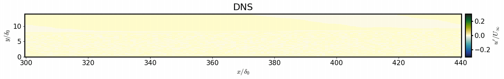

# boundary-layer-gpu

**A GPU-native incompressible boundary-layer DNS solver in CUDA Fortran** —
single-GPU by default, multi-GPU capable, with a test harness that
gates every change on *same physics, measured speedup*.

The solver computes spatially-developing flat-plate boundary layers:
laminar, transitional (Tollmien-Schlichting modes or freestream-turbulence
bypass transition via a precursor-HIT inflow library), and turbulent.
2nd-order staggered finite differences, explicit RK2/RK3, fractional-step
projection with an FFT-diagonalized Poisson solve (half-length real-DCT in
x, Fourier in z, tridiagonal Thomas in y) — everything resident on the GPU;
the host is touched only for gated statistics, monitoring, and I/O.

<picture>
  <source media="(prefers-color-scheme: dark)" srcset="docs/img/tbl_hit_transition_dark.gif">
  
</picture>

*Bypass transition of a flat-plate boundary layer under 3% freestream
turbulence (precursor-HIT inflow library), computed on two A100 z-slabs:
$u'/U_\infty$ in a wall-normal $x$–$y$ plane at equal aspect ratio, axes in
inlet-$\delta_{99}$ units. Freestream turbulence above drives streaks and
turbulent spots in the layer below.*

## Repository layout

```
src/          the CUDA Fortran solver          -> boundary_layer_cuda
cases/        runnable cases: laminar/, transition/, turbulent_lund/,
              profiles/ (mean-profile data used by inflow generators)
tests/        try the code + the gating harness: physics pass/fail,
              field-level diffs, timing
docs/         design documents, parameter reference, validation records
```

The earlier CPU (MPI) and OpenACC implementations are kept in git history
(`gpu-openacc` branch) — `main` is CUDA-only.

## Build and run

Requires the NVIDIA HPC SDK (nvfortran, 24.3+) and a cc80+ GPU.

```bash
cd src && make                    # -> ./boundary_layer_cuda at the repo root
cd ..
mpirun -np 1 ./boundary_layer_cuda -i cases/laminar/laminar.turbb
```

`make DEBUG=1` builds with bounds checks and per-kernel launch-error
checking. Multi-GPU (experimental; requires `nx-2` and `nz-2` divisible by
the rank count, and UCX CUDA transports):

```bash
CUDA_VISIBLE_DEVICES=0,1 mpirun -np 2 --mca pml ucx \
  -x UCX_TLS=self,sm,cuda_copy,cuda_ipc -x UCX_MEMTYPE_CACHE=n \
  ./boundary_layer_cuda -i case.turbb
```

**Grid-size tip:** the Poisson FFT lengths are `nx-2` and `nz-2` — choose
them with small prime factors (2, 3, 5, 7). A large prime factor (e.g.
`812 = 4*7*29`) forces cuFFT onto a slow path and costs ~10% per step.

## Tests

The fastest end-to-end check (laminar Blasius case, ~8 s on an A100) and the
harness that gates every solver change (see
[tests/README.md](tests/README.md) for the method and the full
baseline/result tables):

```bash
python3 tests/validate.py laminar --exe ./boundary_layer_cuda --label my-run
python3 tests/validate.py compare --a openacc-ref --b my-run
python3 tests/validate.py bench   --exe ./boundary_layer_cuda --label my-run
```

- `laminar`: Blasius case with numeric checks (Cf vs the similarity
  solution and a golden value, divergence at machine zero, freestream
  cleanliness) — runs in seconds.
- `compare`: field-by-field diff between two builds/runs + speedup.
- `bench`: production-sized grid, ns/cell/step.

## Cases

| case | what it is |
|---|---|
| `cases/laminar` | Blasius flat plate; the correctness gate (~8 s on an A100) |
| `cases/transition` | K-type transition from Tollmien-Schlichting inflow modes |
| `cases/turbulent_lund` | turbulent BL with Lund recycling inflow (`inflow_flag = 3/5`) — ported and validated to machine precision vs the CPU solver; see [cases/turbulent_lund/README.md](cases/turbulent_lund/README.md) |

Input format: `key = value` text files (`.turbb`); see the commented
examples in each case directory and the parameter table in
[docs/input_parameters.turbb](docs/input_parameters.turbb). The CUDA solver
covers the DNS path (RK2/RK3, Blasius/TS-mode/Lund-recycling/HIT inflows,
Dirichlet, blowing-suction or zero-shear top, no-slip wall, restart, box
output); LES and wall models are not ported (they exist in the pre-port MPI
code, `gpu-openacc` branch) and the solver stops with a clear message if
one is requested.

## Documentation

- [docs/CUDA_PORT_DESIGN.md](docs/CUDA_PORT_DESIGN.md) — the port's design
  contract: module layout, verbatim-numerics and determinism conventions.
- [docs/MULTI_GPU_DESIGN.md](docs/MULTI_GPU_DESIGN.md) — the multi-GPU
  architecture, implementation status, and measured scaling (including
  what does *not* scale on PCIe and why).
- [tests/README.md](tests/README.md) — test/validation methodology
  and the complete record of baselines and results.

## Performance summary (A100-PCIE-40GB, nvfortran 24.3)

Speedup of one A100 GPU vs the original CPU solver (16-core MPI):

| case | CPU solver (MPI) | CUDA solver | speedup |
|---|---|---|---|
| transition 814x125x66, production cadence | 87 ms/step (16 cores) | **10.0 ms/step** (1 GPU) | 8.7x |
| laminar 302x64x8 | 25.5 ms/step (6 cores*) | 0.83 ms/step (1 GPU) | 31x |
| capacity: 3074x341x258 (270M cells, ~65 GB) | 28.1 s/step (16 cores) | 0.7-0.8 s/step (4 GPUs) | ~35-40x |

*The z-slab decomposition requires `nz-2` divisible by the rank count, so
the laminar case (nz = 8) caps at 6 ranks. CPU numbers are median
per-monitor-interval timings of the pre-port MPI solver rebuilt from this
repository's history (gfortran -O2 + FFTW 3.3.10), same machine as the
GPU runs (dual-socket 28-core Xeon host of the A100s).*

## Credits

Original CPU/MPI solver by **Adrian Lozano-Duran** (Computational
Turbulence Group, MIT). OpenACC port, CUDA Fortran rewrite, and multi-GPU
implementation by **Alvaro Martinez Sanchez**.

## License

Not yet licensed for redistribution — contact the authors.
