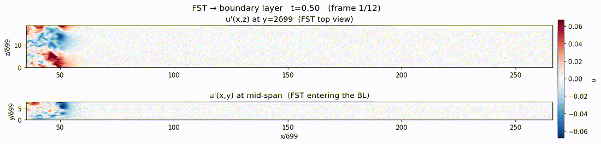

# Figures

Diagnostic and validation figures from the swept-HIT-box freestream-turbulence
inflow + bypass-transition DNS (`transition_hit_v2` workflow).

## `movies/` — freestream turbulence entering the boundary layer
`fst_entering_bl_prelim.gif` / `.mp4` — **preliminary** movie from the Marlowe production run
(`tbl_mz_sw080`, sweep_period=0.80 inflow, top_flag=4 zero-shear top): the FST enters from the
inlet into a **clean Blasius/laminar** start. Top: u'(x,z) at y=2δ99; bottom: u'(x,y) mid-span
side view. **Colorbar fixed** (±0.06) across every frame. Currently t=0.5→5.5 — the FST front has
reached the front ~25% of the 900-δ99 plate; will be extended as the run advances toward step 420000.

## `longx8_inflow/` — swept-HIT inflow isotropy, echo, and spectra (LONGX=8)
- `streamwise_echo_3case.png` — streamwise autocorrelation R_uu(Δx): current Marlowe
  (LONGX=4, echo +0.283 @74 δ99) vs the failed 8×-tiled box (+0.754 @18.5 δ99) vs the
  genuine random-IC LONGX=8 (+0.02 @148 δ99). The genuine box removes the box-period echo.
- `tiling_trap_diagnosis.png` — why an 8×-tiled IC fails: it stays exactly spatially
  periodic forever, so the swept inflow echoes at the 18.5 δ99 tile sub-period.
- `echo_isotropy_3case.png` — genuine LONGX=8 echo + isotropy overview.
- `eddy_isotropy_sweep0.80.png` — eddy isotropy at y=2 δ99 (R_x solid vs R_z dashed) at
  the tuned sweep_period=0.80 (well-averaged t=12 run): **L_x/L_z(u') ≈ 1.9** (canonical
  isotropic ~2). NOTE the box-period echo at this sweep_period is ~0.09 @112 δ99 (above the
  0.05 wish) — isotropy (~2.0, needs faster sweep) and low echo (needs slower sweep) trade
  off on this LONGX=8 box; still 3× lower echo than the current Marlowe inflow (0.28 @74 δ99).
- `streamwise_view_sweep0.80.png` — u'(x,z) top + u'(x,y) side view, true aspect.
- `inflow_spectra_vs_v2.png` — inflow 1D energy spectra E(k_x), E(k_z) at y=2 δ99 vs the
  deployed v2 inflow: k^-5/3 inertial range, matching energy levels, no echo spike.
- `box_3d_shell_spectrum.png` — genuine LONGX=8 HIT box 3D shell spectrum E(k): forcing
  peak at |k|~1 → k^-5/3 inertial range → dissipation roll-off.

## `tu5_validation/` — Tu=5% bypass-transition validation
- `Tu5_topview.png`, `Tu5_sideview.png`, `Tu5_zoom.png` — u' snapshot at t=30 (clean
  streaks → spots → turbulent bypass transition).
- `compare_Tu3_Tu5.pdf` — Cf, H, Re_θ overlay of Tu=3% vs Tu=5% (earlier transition at
  higher Tu).
