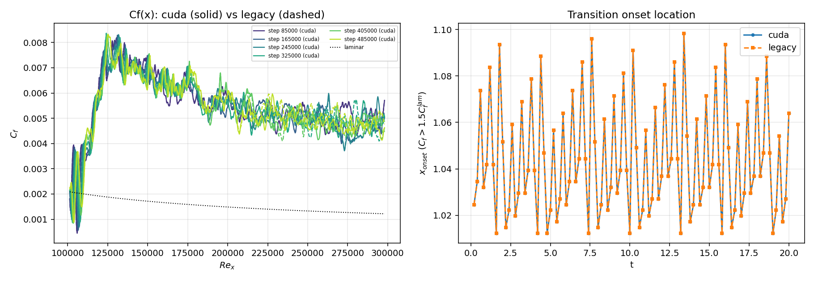

# Validation and benchmarking harness

Every solver change is gated on this harness: **same physics, measured
speedup**. It runs the solver, checks the results numerically (no eyeballing),
and records timing in a machine-readable form.

## Quick start

```bash
# from the repo root
python3 validation/validate.py laminar --exe ./boundary_layer_gpu --label openacc-ref
python3 validation/validate.py bench   --exe ./boundary_layer_gpu --label openacc-ref
python3 validation/validate.py compare --a openacc-ref --b cuda-v1
```

## What each subcommand does

- **laminar** — runs `cases/laminar/laminar.turbb` (302x64x8 Blasius BL,
  2000 steps, ~8 s on an A100) and checks:
  - mean Cf vs the golden value from the validated OpenACC baseline
  - max divergence < 1e-12 (projection works)
  - freestream overshoot |max(U)-1| < 1e-4
  - pointwise Cf(x) vs Blasius 0.664/sqrt(Re_x) within 3% (buffers excluded)

  It also plots the inlet U,V profiles against the analytical Blasius
  solution (`ic_inflow.png` — inflow BC check) and writes `summary.json`.

- **bench** — runs a production-sized grid (814x125x66, 6.7M cells, the
  transition-case grid with plain Blasius inflow) for `--nsteps` steps and
  reports ns/cell/step. The laminar grid is launch-latency dominated, so
  speedups quoted for real runs must come from this case.

- **compare** — field-by-field diff (U,V,W of the final laminar snapshot)
  between two labeled runs plus a timing table and speedup. Default
  tolerance: max relative diff < 1e-8. The solver is deterministic
  (verified: two identical runs are bitwise equal), so any diff is caused
  by the code change being tested.

## Layout

```
validation/
  validate.py        the harness (single file, no exotic deps: numpy/scipy/mpl)
  cases/bench_dns.turbb
  runs/<label>/...   run dirs + summary.json (disposable, gitignored)
  runs/compare_*.json
```

## Baseline record (A100-PCIE-40GB, nvhpc 24.3, CUDA driver on tifa)

| build | case | ms/step | ns/cell/step |
|---|---|---|---|
| openacc-ref (commit 0537a6c) | laminar 302x64x8 | 2.35 | 15.2 |
| openacc-ref (commit 0537a6c) | bench 814x125x66 | 15.53 | 2.31 |
| cuda-v1 (Phase 2 port) | laminar 302x64x8 | 1.13 | 7.3 |
| cuda-v1 (Phase 2 port) | bench 814x125x66 | 15.55 | 2.32 |
| cuda-v4 (Phase 3: fusions + async reductions) | laminar 302x64x8 | 0.73 | 4.7 |
| cuda-v4 (Phase 3: fusions + async reductions) | bench 814x125x66 | 13.8-14.1 | 2.05-2.10 |
| cuda-v5 (half-length real-DCT Poisson) | laminar 302x64x8 | 0.83 | 5.4 |
| cuda-v5 (half-length real-DCT Poisson) | bench 814x125x66 | 14.0 | 2.08 |
| cuda-v5 (half-length real-DCT Poisson) | bench 812x125x66 (FFT-friendly) | 12.5 | 1.87 |

cuda-v5 changes the DCT factorization (Makhoul half-length; validated
against the double-length pipeline at machine precision in a numpy
prototype, and vs openacc-ref at 3.6e-14 on the laminar case). It halves
the Poisson work-array memory and is ~6-10% faster than v4 on
FFT-friendly grids (nx-2 with small prime factors); on nx=814
(812 = 4*7*29) cuFFT's large-prime path makes it a wash. See the
grid-size tip in the top-level README.

cuda-v1 vs openacc-ref: max relative field diff 4.5e-12 after 2000
laminar steps; both builds bitwise run-to-run deterministic. All Phase 3
optimizations so far (RHS fusion, Poisson pack fusions, save+advance
fusion, device-resident mass-flux reduction) are bitwise-identical to
cuda-v1 by construction and verified so by `compare --tol 1e-15`.
Bench numbers vary +-0.3 ms run-to-run (GPU clocks); quote medians of
several runs when comparing. NOTE: the bench case monitors every 50
steps, which folds monitor/stats overhead into the interval clock; at
production cadence (transition case, nmonitor=1000, same 814x125x66
grid) cuda-v4 runs 10.0 ms/step vs 13.2 for the OpenACC reference
(1.32x).

## Full transition physics validation (2026-07-31)



Complete 500k-step transition runs (cases/transition, 10 flow-throughs)
on both builds: transition-onset location (x where Cf > 1.5 Cf_lam)
IDENTICAL to 4 decimals at every 5000-step checkpoint over 20 time
units, including every phase oscillation of the TS-driven onset;
Cf(x) curves overlay through transition and turbulence. Instantaneous
turbulent Cf decorrelates progressively (5.6e-6 at t=3.4 to ~5% RMS at
t=19.4) exactly as chaotic dynamics requires. Timing over the full run:
CUDA 10.3 ms/step vs legacy 13.7 (1.33x).

## Multi-GPU validation (2026-07-31, P5.1-P5.4)

All multi-rank results vs the single-rank solver on the transition case
(2000 steps, active TS modes, fields in U_inf units):
- 2 ranks: max field diff 8.7e-15; 4 ranks: 8.9e-15
- statistics files numerically identical (0.00) at 2 ranks
- box files: identical headers/grids, payloads within one float32 ulp
- restart chains: single-rank BITWISE-exact vs straight-through;
  2-rank at 7.3e-15; snapshots interchange between any rank counts
- capacity: the 3074x341x258 config (270M cells, ~65 GB state,
  impossible on one A100-40GB) runs on 4 ranks, div ~3e-13,
  ~700-800 ms/step

Strong scaling on PCIe is NEGATIVE at test size (10.0 / 15.0 / 18.7
ms/step at P = 1/2/4 on the 6.7M-cell grid) — multi-GPU on tifa is a
capacity feature; see docs/MULTI_GPU_DESIGN.md. Multi-rank launches
REQUIRE the UCX flags printed in the README.

## Transition-path validation (2026-07-30)

The TS-mode temporal inflow path (unused by the laminar case) was
validated head-to-head on cases/transition (5000 steps, active
temporal modes): max relative field diff 1.8e-14 (U), 2.4e-14 (V/W),
identical Cf to all printed digits, max divergence ~1.4e-12 in both.

(Laminar-grid timing is kernel-launch-latency dominated; the bench number is
the one that predicts production performance.)
